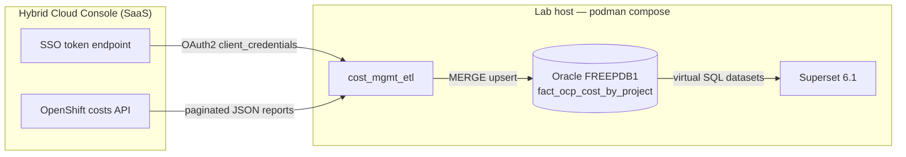
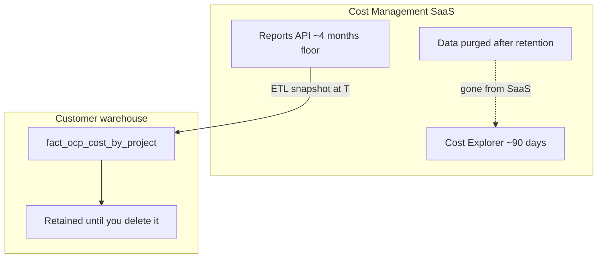
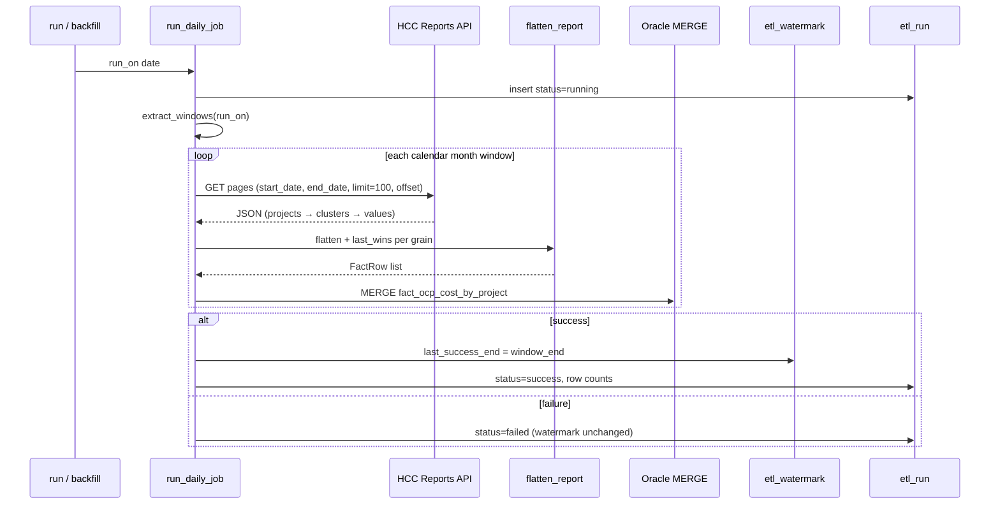

# Cost Management warehouse PoC — architecture

This PoC copies Hybrid Cloud Console (HCC) OpenShift project cost reports into a **customer-owned Oracle warehouse** and visualizes them with Apache Superset. Rows are **extract-time snapshots** of the Cost Management API, not a live mirror of Cost Explorer.

**Why this exists:** Cost Management keeps roughly **90 days** of interactive history in SaaS (product language: “last 90 days”; API floor is often **~4 billed months** via materialized views). After that window, SaaS data is purged. The ETL’s job is to **copy daily cost facts into the warehouse before they disappear**, so BI and audits can query **years** of history from SQL instead of depending on the cloud retention window.

For lab commands (compose, credentials, rollback), see [README](../README.md).

**On this page:** [Incremental ingestion](#incremental-ingestion) · [Integration topology](#integration-topology) · [SaaS retention](#saas-retention) · [Warehouse schema](#warehouse-schema) · [BI layer](#bi-layer)

## Quick path

1. Start Oracle: `podman-compose up -d oracle`
2. Load data: `python -m cost_mgmt_etl backfill` (needs `COSTMGMT_*` in gitignored `.env`)
3. Start BI: `podman-compose --profile bi up -d`
4. Open dashboard: http://127.0.0.1:8088/superset/dashboard/ocp-cost-warehouse/ (admin / admin)

<h2 id="integration-topology">Integration topology</h2>



| Component | Role | Credentials |
|-----------|------|-------------|
| HCC SSO | Issues short-lived access tokens (~15 min) | `COSTMGMT_CLIENT_ID`, `COSTMGMT_CLIENT_SECRET` (service account) |
| Cost Reports API | Source of OpenShift project/cluster daily costs | Bearer token; role **Cost OpenShift Viewer** minimum |
| `cost_mgmt_etl` | Extract, flatten, load, watermark audit | Reads `.env`; never logs secrets |
| Oracle (`costmgmt` schema) | Durable fact store beyond SaaS retention | Lab user `costmgmt` / `APP_USER_PASSWORD` |
| Superset | Warehouse BI only (no live API) | `APP_USER_PASSWORD`, `SUPERSET_SECRET_KEY`; **no** `COSTMGMT_*` on BI container |

**Out of scope for this path:** Grafana + Infinity querying the live API (separate visualization PoC). Do not mix API series and warehouse measures on one chart.

<h2 id="saas-retention">SaaS retention vs warehouse retention</h2>



| Layer | What you get | What happens when it ages out |
|-------|----------------|-------------------------------|
| Cost Explorer UI | Interactive window (~90 days) | Older months unavailable in UI |
| Reports API | `start_date` / `end_date` within materialized-view floor (~4 months) | Cannot backfill expired months from API |
| This warehouse | Every successful extract, by `usage_date` | **Unchanged** in Oracle after SaaS purge — if you extracted it in time |

**Extract-or-lose-it:** If the daily job is down longer than the SaaS window, those days are gone from HCC and cannot be recovered from the API.

<h2 id="incremental-ingestion">Incremental ingestion</h2>

Incremental behavior is **policy-driven** (calendar months), not watermark-driven sliding windows. The watermark records **how far a successful run reached**; it does **not** choose the next API window.

### Daily window policy

`extract_windows(run_on)` in `cost_mgmt_etl/jobs.py`:

| Condition | API window pulled |
|-----------|-------------------|
| Every `run` | **Current calendar month** from day 1 through `run_on` (inclusive) |
| `run_on` is **day 2** of a month | **Also** the **previous full calendar month** |

Rationale:

- **Current month re-pull** — cost model / price list changes recalculate the current month from day 1 in the API. Re-reading the whole month keeps the warehouse aligned with Cost Explorer.
- **Day-2 previous month** — cloud bills and late adjustments often finalize shortly after month-end; one extra full-month pull catches closed-month restatement (same pattern as community sync tools).

### Per-run pipeline



### Idempotent load

- **Grain (unique key):** `(usage_date, source_type, cluster_id, project, currency)`
- **Policy:** Type-1 overwrite — `MERGE` updates measures and `extracted_at` on conflict (`cost_mgmt_etl/load.py`)
- **Duplicates in one batch:** `last_wins` in flatten — never sum duplicate `(date, project, …)` rows from pagination or overlapping pages
- **Fail-closed:** API or load errors mark `etl_run` failed and **do not** advance `etl_watermark` (see `tests/integration/test_watermark.py`)

### Operational modes

| Command | When to use | What it does |
|---------|-------------|--------------|
| `python -m cost_mgmt_etl run` | Daily schedule | `extract_windows(today)` — current month (+ previous month on day 2) |
| `python -m cost_mgmt_etl backfill [months]` | Initial seed or lab demo | Runs `run_daily_job` at month-end for each of the last *N* months (default 4), capped at today |
| `podman-compose --profile etl up` | One-shot compose load | Installs deps and runs `backfill` inside the `etl` container |

**Never** use `filter[time_scope_value]=-90` as the load design. Wide preset windows can duplicate `date+project` at billing-month boundaries; this ETL uses explicit `start_date` / `end_date` per calendar month.

## Extract and flatten

`CostReportsClient` (`cost_mgmt_etl/client.py`):

- Endpoint: `https://console.redhat.com/api/cost-management/v1/reports/openshift/costs/`
- `filter[resolution]=daily`, `filter[limit]=100`, paginated `filter[offset]`
- Preferred `group_by[project]=*` + `group_by[cluster]=*`; on `check_group_by_limit`, falls back to project-only and `cluster_id='unknown'`
- JSON shape: `data[] → projects[] → clusters[] → values[]` (cost, infrastructure, supplementary layers on each leaf)

Currency is taken from API `units` (this lab org: **BRL**), not hardcoded in SQL or charts.

<h2 id="warehouse-schema">Warehouse schema</h2>

Defined in `cost_mgmt_etl/sql/01_ddl.sql`:

| Table | Purpose |
|-------|---------|
| `fact_ocp_cost_by_project` | Daily wide facts: `cost_*`, `infra_total`, `supplementary_total` |
| `etl_watermark` | `last_success_end`, `last_success_run_id` per `job_name` |
| `etl_run` | Per-attempt audit: window, status, row counts, error message |

Measures are stored as separate columns. **Do not add** `cost_total` to supplementary or infra series in BI — they are independent layers from the API.

<h2 id="bi-layer">BI layer (Superset)</h2>

- Compose profile `bi`: Superset 6.1 on `127.0.0.1:8088`, metadata in volume `superset-home`
- Connects to Oracle with `oracle+oracledb` thin (`superset/superset_config.py`)
- On startup: `bootstrap_dashboards.py` registers database, four virtual datasets from `superset/datasets/*.yaml`, charts, and published dashboard slug **`ocp-cost-warehouse`**
- Charts query **warehouse SQL only** (BRL filter, grain `GROUP BY` on remaining dimensions)

## Lab vs production

| Topic | This PoC (lab) | Typical production |
|-------|----------------|-------------------|
| Database | Oracle Free in compose | Customer Oracle or PostgreSQL |
| Scheduler | Manual CLI or compose `etl` profile | CronJob / systemd / enterprise scheduler |
| Secrets | `.env` (gitignored) | Vault / OpenShift Secret |
| HA / backup | Single container + volume `oracle-data` | DBA backup, DR, monitoring on watermark lag |

## Package map

```
cost_mgmt_etl/
  auth.py      OAuth2 token refresh (in-memory only)
  client.py    Paginated month-bounded API extract
  flatten.py   JSON → FactRow, nested clusters, last_wins
  load.py      Oracle MERGE
  jobs.py      Window policy, watermark, etl_run
  cli.py       run / backfill entrypoints
  stack.py     Safe compose launcher (allowlisted paths only)
  sql/01_ddl.sql
superset/
  bootstrap_dashboards.py
  datasets/*.yaml
  superset_config.py
```

## Related constraints

- Stored rows reflect **API opinion at extract time**. Restated months overwrite prior values at the same grain (by design).
- OpenShift **infra** may be `0.0` when no cloud CUR is linked; supplementary (cost model) can still be non-zero.
- Samples such as [project-koku/grafana-dashboard-sample](https://github.com/project-koku/grafana-dashboard-sample) are **unsupported**; this warehouse is a customer integration pattern, not a Red Hat product entitlement.
